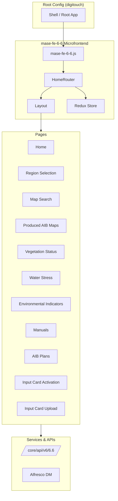

# High-Level Architecture

This document describes the system design and main components of the mase-fe-6-6 microfrontend.

## Overview

mase-fe-6-6 is a **Single-SPA** microfrontend that mounts inside the MASE digitouch portal. It provides wildfire (incendi boschivi) management features: map visualization, document management, and fire risk calculation tools.

## Architecture Diagram

## Single-SPA Integration

The app exports lifecycle functions for Single-SPA:

| Export | Purpose |
|--------|---------|
| `bootstrap` | Initialize before mount |
| `mount` | Render into DOM |
| `unmount` | Cleanup on navigation away |

Entry point: `src/mase-fe-6-6.js`. The root component is `HomeRouter`, which wraps the app with Redux `Provider` and `RouterProvider`.

## Routing Structure

Base path: `/portalediaccesso/incendi-boschivi/6.6/`

| Route | Component | Feature Flag |
|-------|-----------|--------------|
| `/` | Home | HOMEPAGE |
| `scelta-della-regione` | RegionSelection | REGION_SELECTION |
| `ricerca-delle-mappe` | MapSearch | MAP_SEARCH |
| `ricerca-delle-mappe-AIB-prodotte` | ProducedAIBMapSearch | MAP_SEARCH_PRODUCED |
| `carta-dello-stato-di-vegetazione` | VegetationStatusMap | CARTA_VEGETAZIONE |
| `carta-dello-stress-idrico` | WaterStressMap | CARTA_STRESS_IDRICO |
| `indicatori-ambientali-periodo` | EnvironmentalIndicators | INDICATORI_AMBIENTALI |
| `manuali` | Manuals | MANUALI |
| `piani-aib` | AIBPlans | PIANI_AIB |
| `attivazione-carte-input` | InputCardActivation | INPUT_CARD_ACTIVATION |
| `caricamento-carta-input` | InputCardUpload | INPUT_CARD_UPLOAD |
| `help-online` | HelpOnline | (always) |

Routes are protected by feature flags (MVP config) and optionally by role-based access (e.g. Input Card Activation).

## State Management

Redux store slices:

| Slice | Purpose |
|-------|---------|
| `dataSlice` (userReducer) | User profile, authentication state |
| `job` | Algorithm job status (polling) |
| `validationJob` | Map validation job status |
| `sharingJob` | Sharing job status |

## Key Dependencies

- **@mase/commons-router** — `createMaseBrowserRouter` for auth-aware routing
- **@mase/commons-client** — `userAuthenticated` for user data
- **@mase/commons-geoinsight** — Map and GIS components
- **@mase/commons-event** — `wait` for async handling
- **dxc-webkit** — UI components (Spinner, icons, etc.)

## MVP Versioning

Features are gated by `MVP_VERSION` in `src/config/config.js`:

- **mvp-1** — Core maps, region selection, map search
- **mvp-2** — + Produced AIB maps, documents, input card tools, algorithms 7, 8, 13
- **mvp-3** — + Fire danger (pericolosità incendio)
