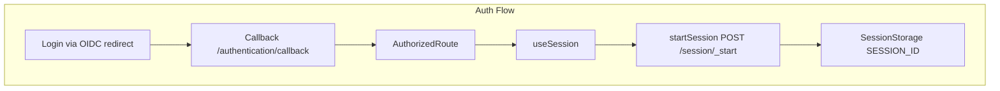
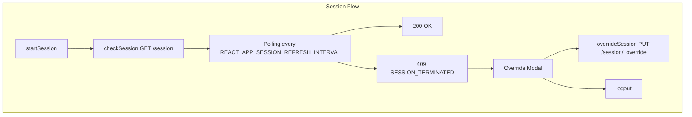
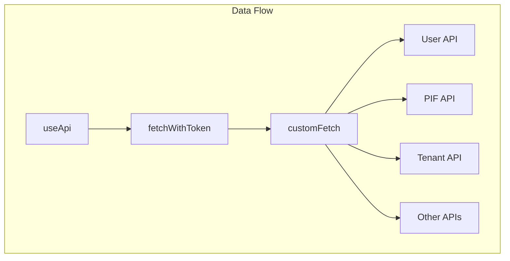

# txm-ui: Data Flow

## Overview

This document describes how data moves through txm-ui: the bootstrap sequence, auth and session flow, API calls, and session storage usage.

---

## Request Lifecycle

```
Wellknown fetch → OIDC auth → AuthorizedRoute → useSession → usePermissions → useApi → Backend APIs
```

1. **Wellknown** — Fetched from `REACT_APP_WELLKNOWN_API_URL` (or from `process.env` if `REACT_APP_USE_LOCAL_ENV=true`). Stored in `sessionStorage.WK_VARS`.
2. **OIDC** — User logs in via IdP redirect; tokens stored by @axa-fr/react-oidc.
3. **AuthorizedRoute** — Wraps protected routes; uses `OidcSecure` and `useSession`.
4. **useSession** — Starts session, polls checkSession; on 409 shows override modal or logs out.
5. **usePermissions** — Fetches getMe, firstLogin if needed; stores user in sessionStorage.
6. **useApi** — Builds API clients with `fetchWithToken`; all requests include `Authorization` and `x-tenant-id`.

---

## Auth Flow



- **Login**: User hits `/login` or protected route → OIDC redirects to IdP.
- **Callback**: IdP redirects to `/authentication/callback` with tokens.
- **AuthorizedRoute**: Renders children only when authenticated; runs `useSession`.
- **startSession**: Called when user exists but no SESSION_ID; POST to User API `/session/_start`.
- **SESSION_ID**: Stored in sessionStorage for subsequent checkSession polling.

---

## First-Login Flow

When `getMe` returns 404 (user not yet in User API):

1. `usePermissions` triggers `setUserSubject` (POST `/firstLogin`).
2. User API links IdP subject to user by email, returns User.
3. `refetch` getMe; user and permissions stored in sessionStorage (`USER_DATA`).
4. If user has `endDate` in past → redirect to `/inactive-user`.
5. On error → redirect to `/offline-page`.

---

## Session Flow



- **startSession**: POST `/session/_start` when user exists and no sessionId.
- **checkSession**: GET `/session`; polling interval from `REACT_APP_SESSION_REFRESH_INTERVAL` (default 30000 ms).
- **409**: Session limit exceeded or terminated → `showSessionModal` (override or logout).
- **Override**: PUT `/session/_override` → new sessionId stored; modal closed.
- **Logout**: POST `/session/_logout`, then OIDC logout and redirect.

---

## API Flow



- **useApi**: Reads `WellknownVars` for API URLs; builds `buildUserApi`, `buildPifApi`, etc. with `fetchWithToken`.
- **fetchWithToken**: `useOidcFetch` wrapper; adds `Authorization: Bearer <token>` and `x-tenant-id` (from sessionStorage TENANT).
- **customFetch**: Wraps `fetch`; handles JSON body, validates status; throws `FetchError` on non-2xx.

---

## Session Storage Keys

| Key | Purpose |
|-----|---------|
| `WK_VARS` | Wellknown configuration (API URLs, auth, AWS RUM) |
| `USER_DATA` | User + permissions from getMe |
| `TENANT` | Selected tenant (for x-tenant-id) |
| `LANDING_PAGE` | Landing page cards (LOV) |
| `SESSION_ID` | Active session ID |

---

## Context Propagation

| Context | Provider | Purpose |
|--------|----------|---------|
| WellknownVars | useWellknown | API URLs, auth config, intervals |
| OidcSecure | OidcProvider | Protects routes; requires auth |
| SessionModalContext | SessionModalProvider | showSessionModal, hideModal |
| ErrorModalContext | useErrorModal | showErrorModal |

---

## Trade-offs

- **Session storage for user/tenant**: No global state store; components read from sessionStorage via hooks.
- **Polling for session**: Interval-based; no WebSocket. 409 triggers immediate modal or logout.
- **Wellknown for URLs**: Production uses Wellknown; dev can bypass with local env.
