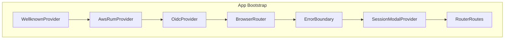

# txm-ui: High-Level Architecture

## Overview

txm-ui is a React 18 single-page application (SPA) that serves as the frontend for the TextGenius/TXM platform. It is built with Create React App (via react-app-rewired), uses OpenID Connect (OIDC) for authentication, and integrates with multiple backend APIs for projects, items, findings, users, tenants, and analytics.

**Stack**: React 18, TypeScript, MUI (Material-UI), React Query, React Router v6, @axa-fr/react-oidc, AWS RUM.

---

## Component Hierarchy

The application bootstrap follows a nested provider structure:

1. **WellknownProvider** — Loads configuration from Wellknown API (or local env). Blocks render until config is available.
2. **AwsRumProvider** — AWS RUM for performance, HTTP, errors, and interaction telemetry.
3. **OidcProvider** — OIDC authentication (Cognito/Keycloak). Handles login, callback, token refresh.
4. **BrowserRouter** — React Router for client-side routing.
5. **ErrorBoundary** — Catches React errors, shows crash fallback.
6. **SessionModalProvider** — Context for session-limit modal (override or logout).
7. **RouterRoutes** — Route definitions; most routes wrapped in `AuthorizedRoute`.

---

## Key Modules

| Module | Path | Purpose |
|--------|------|---------|
| **api** | `src/api/` | API client builders, custom fetch, service modules |
| **infrastructure** | `src/infrastructure/` | Hooks (useWellknown, useSession, usePermissions), routing, i18n, utils |
| **pages** | `src/pages/` | Page components (Projects, Items, Findings, Settings, etc.) |
| **components** | `src/components/` | Reusable UI (Header, modals, auth, forms) |
| **models** | `src/models/` | TypeScript types, enums (User, Project, Permissions, SessionStorageKeys) |
| **assets** | `src/assets/` | Icons, images |

---

## External Integrations

| System | Purpose |
|--------|---------|
| **OIDC IdP** (Cognito/Keycloak) | Authentication, token issuance, logout |
| **Wellknown API** | Runtime configuration (API URLs, auth, AWS RUM) |
| **User API** | Users, groups, me/self, firstLogin, session |
| **PIF API** | Projects, items, findings, batch jobs |
| **Tenant API** | Tenant selection, tenant metadata |
| **Analyzer API** | Analyzers configuration |
| **Omnia API** | Omnia search |
| **LOV API** | List-of-values, landing cards |
| **Dashboard API** | Analytics, charts |
| **Chat API** | Chat-to-document |
| **Form API** | Form composition |
| **Feedback API** | Feedback export |
| **AWS RUM** | Client-side monitoring |

---

## Trade-offs

- **No Redux** — State is managed via React Query, sessionStorage, and React context. Simpler but less centralized.
- **Wellknown for config** — Production config comes from Wellknown API; dev can use `REACT_APP_USE_LOCAL_ENV=true` for local .env.
- **Session polling** — Session validity is checked at intervals; 409 triggers override modal or logout.
- **Multi-API** — Each backend domain has its own API module; URLs come from Wellknown.
