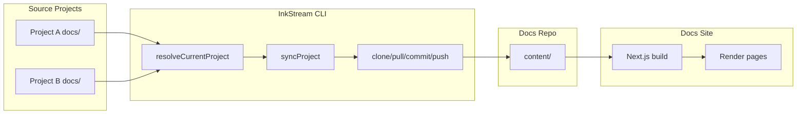
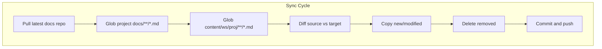

# InkStream: Data Flow

## Overview

This document describes how documentation flows from source projects through the InkStream CLI to the docs site and how it is rendered for users.

---

## End-to-End Flow

---

## Step 1: Project Resolution

When you run `inkstream sync` (or `watch`, `status`, `open`) from a project directory:

1. **Git root** — CLI runs `git rev-parse --show-toplevel` to find the project root.
2. **Config lookup** — Loads global config (`~/.inkstream/config.json`) and all workspace configs.
3. **Path match** — Compares the git root against each project's `localPaths`.
4. **Resolve** — Returns exactly one match: `workspaceSlug`, `projectSlug`, `docsSourcePath`, `docsTargetPath`.

If no match or multiple matches, the CLI exits with an error.

---

## Step 2: Sync Cycle

1. **Pull** — `git fetch` + `git pull --rebase origin main` (unless `--dry-run`).
2. **Glob** — Collect all `.md` files in source and target.
3. **Diff** — New files → add; modified (by content or mtime) → update; removed from source → delete.
4. **Copy** — Write files to `content/[workspace]/[project]/[category]/[slug].md`.
5. **Commit** — `git add -A`, commit with message like `docs(ws/proj): sync docs (+2 added, ~1 updated)`, push.

---

## Step 3: Docs Site Build

The docs site (Next.js) reads content at build time:

1. **getAllPages()** — Recursively scans `content/` for `.md` files.
2. **buildNavTree()** — Groups pages by workspace → project → category.
3. **getPageContent()** — For each request to `/[workspace]/[project]/[category]/[slug]`, reads the file, parses front-matter with `gray-matter`, extracts title.
4. **Render** — Markdown is rendered with `marked`; Mermaid code blocks are rendered with the `mermaid` package.

---

## Data Flow Summary

| Stage | Input | Output |
|-------|-------|--------|
| Resolution | `cwd` (git root) | `ResolvedProject` |
| Sync | `docsSourcePath` | `content/[ws]/[proj]/**/*.md` |
| Build | `content/` | Static/SSR pages |
| Request | URL path | Rendered HTML |

---

## Trade-offs

- **Build-time content** — No runtime CMS; content is baked at build. Rebuild required after sync.
- **File-based** — No database; structure is enforced by folder hierarchy.
- **Debounced watch** — `inkstream watch` uses a 2-second debounce to batch rapid edits before syncing.
