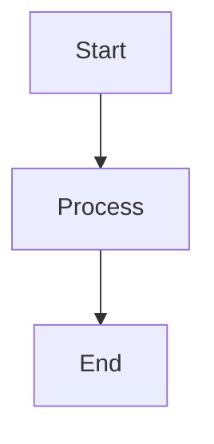

# Writing Documentation for InkStream

## Overview

Documentation lives in your project's `docs/` folder (or custom `docsRoot`). The InkStream CLI syncs these files to the central docs site. Follow the conventions below for consistent, discoverable documentation.

---

## Prerequisites

- Your project is registered with `inkstream project init`.
- You have a `docs/` folder (or the path specified in `docsRoot`).

---

## Folder Structure

Organize docs by category:

```
docs/
  architecture/     # System design, components, data flow
  workflows/        # Step-by-step guides, setup, development
  api/              # API references, CLI commands
  notes/            # Reference material, env vars, indexes
  decisions/        # Architecture Decision Records (ADRs)
  features/         # Feature-specific docs (optional)
```

Each category maps to a URL segment. Example: `docs/workflows/setup.md` → `/[workspace]/[project]/workflows/setup`.

---

## Architecture Docs

When writing in `docs/architecture/*.md`:

Include these sections:

- **Overview** — Brief description of the system or component.
- **Components** — Key modules, tables with paths and purposes.
- **Data Flow** — How data moves; use Mermaid diagrams where helpful.
- **Trade-offs** — Design decisions, limitations, alternatives.

Describe how the project integrates with external systems. Reference internal modules by path when useful.

---

## Workflow Docs

When writing in `docs/workflows/*.md`:

- Use **numbered steps** where possible.
- Include:
  - **Prerequisites** — What the reader needs before starting.
  - **Step-by-step process** — Clear, ordered instructions.
  - **Expected results / verification** — How to confirm success.
  - **Troubleshooting** — Common issues and fixes.

---

## Decision Docs (ADR Style)

When writing in `docs/decisions/*.md`:

Use this structure:

```markdown
# <Short Decision Title>

## Context

## Decision

## Consequences

## Alternatives Considered
```

---

## Front-Matter

Use YAML front-matter for custom page titles:

```yaml
---
title: Custom Page Title
---
```

If omitted, the title is derived from the first `#` heading or the filename (humanized).

---

## Mermaid Diagrams

The docs site supports Mermaid. Use fenced code blocks:

````markdown

````

See [data-flow](../architecture/data-flow) for examples.

---

## File Naming

- Use **kebab-case** for filenames: `getting-started.md`, `api-overview.md`.
- The slug (URL segment) is the filename without `.md`.

---

## Verification

1. Run `inkstream sync --dry-run` to preview changes.
2. Run `inkstream sync` to push.
3. Open the docs site and navigate to your project to verify rendering.
